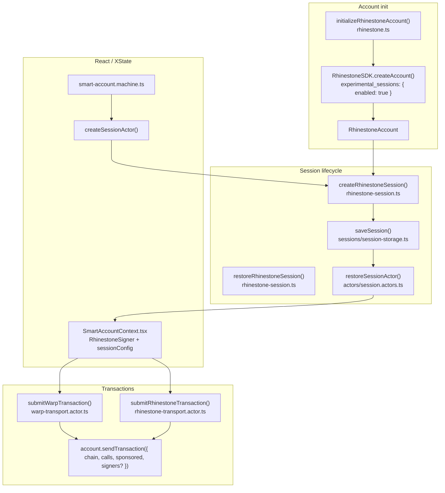
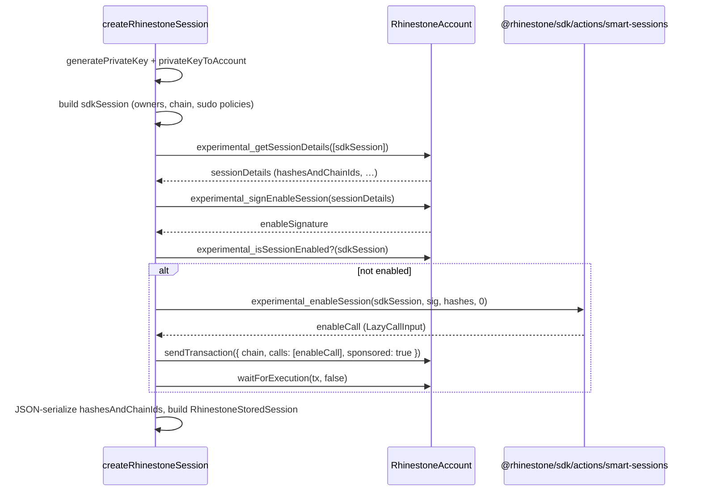
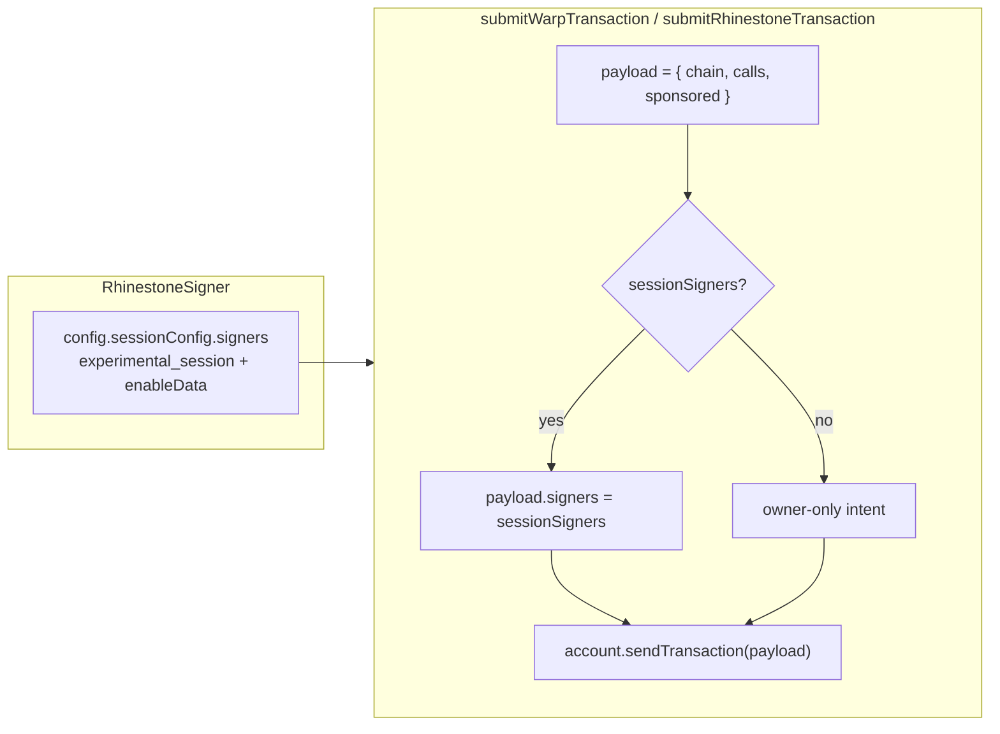

# Rhinestone Smart Sessions (Manager app)

This document describes how **experimental Smart Sessions** are wired in the **manager** app after the on-chain enable + `signers` passthrough update. It maps **files**, **functions**, and **data** so engineers can trace behavior quickly.

> **Scope:** `@rhinestone/sdk@1.2.17` (pinned via workspace `pnpm.overrides`). Smart Sessions remain **experimental** in Rhinestone’s docs—expect API changes.

---

## 1. High-level picture

Three layers:

| Layer | Role |
|--------|------|
| **SDK (`@rhinestone/sdk`)** | `RhinestoneAccount`, session APIs, `sendTransaction`, `experimental_*` session methods, `experimental_enableSession` action. |
| **Manager smart-account** | Creates/restores sessions, persists them, builds `RhinestoneSigner` with `sessionConfig.signers` when a session is active. |
| **`@ens-apps/transaction-manager`** | Submits intents; passes `signers` into `account.sendTransaction` when `config.sessionConfig?.signers` is set (`submitWarpTransaction`, `submitRhinestoneTransaction`). |



---

## 2. Account initialization (validator install)

**File:** `apps/manager/src/lib/smart-account/rhinestone.ts`  
**Function:** `initializeRhinestoneAccount(params: InitializeRhinestoneParams)`

- Builds owner `Account` from `walletClientToAccount(walletClient)` or `wrapParaAccount(createParaAccount(paraClient))`.
- Instantiates `RhinestoneSDK` (with **optional** Pimlico bundler if `VITE_PIMLICO_API_KEY` is set).
- Calls:

```ts
await sdk.createAccount({
  owners: { type: 'ecdsa', accounts: [ownerAccount] },
  experimental_sessions: { enabled: true },
})
```

This matches Rhinestone’s doc: install / prepare the smart-session validator as part of account config.

**Also in this file:** optional `deploy(customSepolia, { sponsored: true })` if the account is not yet deployed.

---

## 3. Creating a session (local key + signatures + on-chain enable)

**File:** `apps/manager/src/lib/smart-account/sessions/rhinestone-session.ts`  
**Function:** `createRhinestoneSession(params: CreateRhinestoneSessionParams): ResultAsync<…, SessionError>`

### 3.1 Steps (in order)

1. **`generatePrivateKey()` / `privateKeyToAccount()`** (`viem/accounts`) — session EOA used as session “owner” in the SDK `Session` object.
2. **Build `sdkSession: Session`** (Rhinestone type):
   - `owners: { type: 'ecdsa', accounts: [sessionAccount] }`
   - `chain` — same chain used for enablement (e.g. Sepolia / `customSepolia`).
   - `actions: [{ policies: [{ type: 'sudo' }] }]` — **broad** permission today (align with Rhinestone security warnings; tighten later with concrete `target` / `selector` + policies).
3. **`rhinestoneAccount.experimental_getSessionDetails([sdkSession])`** — digests + typed-data payload for enablement.
4. **`rhinestoneAccount.experimental_signEnableSession(sessionDetails)`** — **owner** (master account) signs once; yields `enableSignature`.
5. **On-chain install (new behavior):**
   - If **`experimental_isSessionEnabled`** exists and returns `true` for `sdkSession` → **skip** (idempotent).
   - Else:
     - **`experimental_enableSession(sdkSession, enableSignature, sessionDetails.hashesAndChainIds, sessionToEnableIndex)`** from **`@rhinestone/sdk/actions/smart-sessions`** — returns a **lazy call** (`LazyCallInput`) for the calls array.
     - **`rhinestoneAccount.sendTransaction({ chain, calls: [enableCall], sponsored: true })`**
     - **`rhinestoneAccount.waitForExecution(enableTransaction, false)`**
6. **Persist** `RhinestoneStoredSession` (see §4).

### 3.2 Sequence diagram



---

## 4. What gets stored

**Types:** `apps/manager/src/lib/smart-account/sessions/types.ts`

- **`RhinestoneStoredSession`** (`provider: 'rhinestone'`):
  - **`sessionPrivateKey`** — session key (sensitive).
  - **`enableSignature`** — result of `experimental_signEnableSession`.
  - **`hashesAndChainIds`** — JSON string of `{ chainId: string, sessionDigest: Hex }[]` (stringified `chainId` because `bigint` is not JSON-safe).
  - **`sessionConfig`**, **`sessionKeyAddress`**, **`smartAccountAddress`**, **`ownerAddress`**, etc.

**Persistence:** `saveSession()` in `apps/manager/src/lib/smart-account/sessions/session-storage.ts` (invoked from `createSessionActor` after successful creation).

---

## 5. Actors (XState integration)

**File:** `apps/manager/src/lib/smart-account/actors/session.actors.ts`

| Function | Rhinestone behavior |
|----------|---------------------|
| **`createSessionActor(input)`** | If `provider === 'rhinestone'`, requires `rhinestoneAccount` + `chain`. Calls **`createRhinestoneSession`**, then **`saveSession`**. Returns **`sessionClient`** as `{ sessionPrivateKey, enableSignature, hashesAndChainIds }` (not a viem client—see below). |
| **`restoreSessionActor(input)`** | For Rhinestone stored session: **`restoreRhinestoneSession`** then same **`sessionClient`** shape. |
| **`checkExistingSessionActor`** | Reads storage / skip flags (provider must match). |

**File:** `apps/manager/src/lib/smart-account/smart-account.machine.ts`

- Invokes **`fromResultAsync(createSessionActor)`** and similar restore paths.
- Context field **`sessionClient`** holds either a ZeroDev `KernelAccountClient` or the Rhinestone **tuple** above.

---

## 6. Building the transaction-manager `Signer` (session mode)

**File:** `apps/manager/src/lib/smart-account/SmartAccountContext.tsx`

When `provider === 'rhinestone'` and `sessionClient` is the Rhinestone shape, `useMemo` builds a **`RhinestoneSigner`** (`@ens-apps/transaction-manager`):

- **`account`:** `RhinestoneAccount` (`baseClient`).
- **`config.isSessionClient`:** `true` when `sessionClient` is set.
- **`config.sessionConfig.signers`:** SDK-shaped **`SignerSet`**:

```text
{
  type: 'experimental_session',
  session: {
    owners: { type: 'ecdsa', accounts: [privateKeyToAccount(sessionPrivateKey)] },
    chain: customSepolia,
    actions: [{ policies: [{ type: 'sudo' }] }],
  },
  enableData: {
    userSignature: enableSignature,
    hashesAndChainIds: deserialized from JSON (chainId → bigint),
    sessionToEnableIndex: 0,
  },
}
```

**Important:** The **`session`** object here must stay consistent with what was used for **`experimental_getSessionDetails`** / enablement (same owners + chain + policy shape), or validation may fail.

---

## 7. Submitting transactions (signers passthrough)

**Types:** `packages/transaction-manager/src/types/signer.types.ts` — **`RhinestoneSigner.config.sessionConfig?: { signers: SignerSet }`**.

**Warp (intents):** `packages/transaction-manager/src/actors/warp-transport.actor.ts`  
**Function:** `submitWarpTransaction({ request, signer })`

- Builds `account.sendTransaction({ chain, calls, sponsored, ...(sessionSigners && { signers: sessionSigners }) })` where `sessionSigners = config.sessionConfig?.signers`.

**Generic Rhinestone transport:** `packages/transaction-manager/src/actors/rhinestone-transport.actor.ts`  
**Function:** `submitRhinestoneTransaction({ request, signer, publicClient })`

- Same pattern: includes **`signers`** when `sessionConfig.signers` is present.



---

## 8. Infrastructure notes (Warp vs Pimlico)

- **`initializeRhinestoneAccount`** still configures **Pimlico** on the `RhinestoneSDK` when `VITE_PIMLICO_API_KEY` is available (see comments in `rhinestone.ts` about bundler/session-related flows).
- **`defaultInfra`** on the signer (`warp` | `pimlico`) comes from smart-account context and steers which transport the app uses for subsequent txs.

If session-signed `sendTransaction` fails at runtime for a given infra, treat it as an **SDK + infra compatibility** issue and confirm with Rhinestone (Warp vs ERC-4337).

---

## 9. Security reminders (from Rhinestone docs)

- **Session private key** is powerful—store only where appropriate; consider tightening beyond **sudo**.
- **Principle of least privilege:** replace broad `actions` / `sudo` with specific `target` + `selector` and policies when flows are known.
- **Timeboxing:** optional `validUntil` on `CreateRhinestoneSessionParams` / stored session; **`restoreRhinestoneSession`** rejects expired sessions when `validUntil` is set.

---

## 10. Quick file reference

| Area | Path |
|------|------|
| Account + `experimental_sessions` | `apps/manager/src/lib/smart-account/rhinestone.ts` — `initializeRhinestoneAccount` |
| Create / restore session | `apps/manager/src/lib/smart-account/sessions/rhinestone-session.ts` — `createRhinestoneSession`, `restoreRhinestoneSession` |
| Stored session types | `apps/manager/src/lib/smart-account/sessions/types.ts` — `RhinestoneStoredSession`, `isRhinestoneSession` |
| Session actors | `apps/manager/src/lib/smart-account/actors/session.actors.ts` — `createSessionActor`, `restoreSessionActor` |
| XState machine | `apps/manager/src/lib/smart-account/smart-account.machine.ts` |
| Signer + `sessionConfig` | `apps/manager/src/lib/smart-account/SmartAccountContext.tsx` |
| Signer type | `packages/transaction-manager/src/types/signer.types.ts` — `RhinestoneSigner` |
| Warp submit | `packages/transaction-manager/src/actors/warp-transport.actor.ts` — `submitWarpTransaction` |
| Rhinestone submit | `packages/transaction-manager/src/actors/rhinestone-transport.actor.ts` — `submitRhinestoneTransaction` |
| SDK enable action | `@rhinestone/sdk/actions/smart-sessions` — `experimental_enableSession` |

---

## 11. Tests to consult

- `apps/manager/src/lib/smart-account/sessions/rhinestone-session.test.ts` — mocks SDK + `experimental_enableSession`, asserts enable tx path and “already enabled” skip.
- `packages/transaction-manager/src/actors/warp-transport.actor.test.ts` — asserts `signers` forwarded when `sessionConfig` is set.

---

*Last updated to match the smart-session flow with on-chain `experimental_enableSession` + transport `signers` passthrough.*
