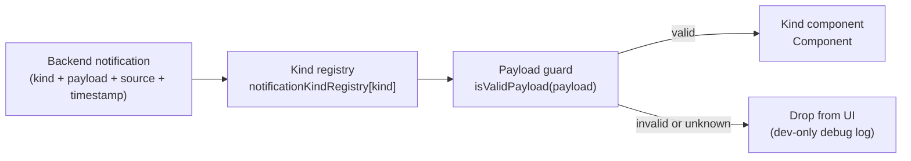

# Notifications Feature

## Overview

Notifications use a kind-centric, render-first architecture.

- `workers/api-worker` owns semantic notification definitions:
  - `kind`
  - payload schema
  - metadata
  - delivery policy
- `apps/manager` owns payload safety checks and rendering.

Each manager kind module defines:

- `isValidPayload(payload)`
- `Component`

Invalid payloads and unknown kinds are dropped from UI.

## Data Flow

## Folder Structure

- `kinds/`
- Per-kind modules and single typed registry.

- `renderers/templates/`
- Optional reusable card templates used by kind components.

- `ui/`
- Notification list/dropdown/item components.

- `queries/`
- TanStack Query API integration.

- `components/settings/*`
- Settings and channel configuration UI.

## Add A New Notification Kind (4 Steps)

1. Add backend semantic kind
- File: `workers/api-worker/src/config/notifications.ts`
- Define `kind`, `source`, `payloadSchema`, `metadata`, `delivery`.

2. Add manager kind module
- File: `apps/manager/src/features/notifications/kinds/<new-kind>.tsx`
- Export `KindDefinition<'<new-kind>'>` with:
  - `kind`
  - `isValidPayload(payload)`
  - `Component`

3. Register kind in one place
- File: `apps/manager/src/features/notifications/kinds/index.ts`
- Add entry to `notificationKindRegistry`.

4. Add focused tests
- Add/extend tests in `kinds/index.test.ts` and relevant UI tests.

## Internal/External Actions

- Internal navigation: use `<Link to="..." params={...}>` directly in the kind component.
- External links: render explicit `<a href="..." target="_blank" rel="noopener noreferrer">`.

## Testing Checklist

- Backend catalog remains semantic-only (no presentation fields).
- Delivery gating behavior unchanged for `opt-in` vs `none` kinds.
- Kind registry covers every backend kind.
- Resolver behavior:
  - valid => renderable
  - invalid payload => filtered out
  - unknown kind => filtered out
- Dropdown/list keep loading/error/empty/data behavior.
