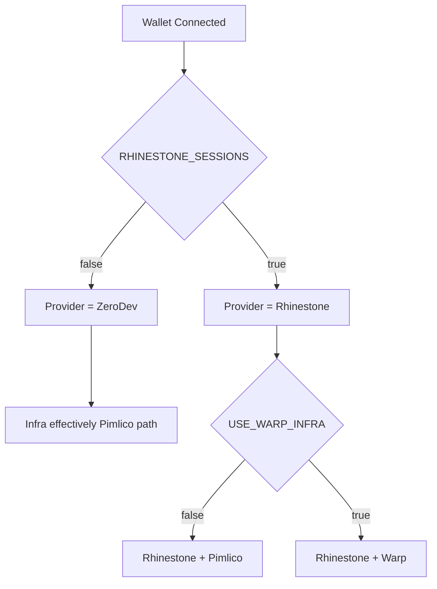
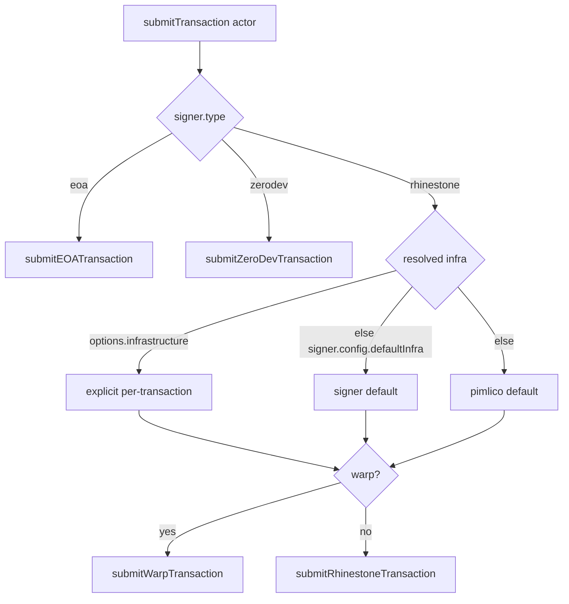
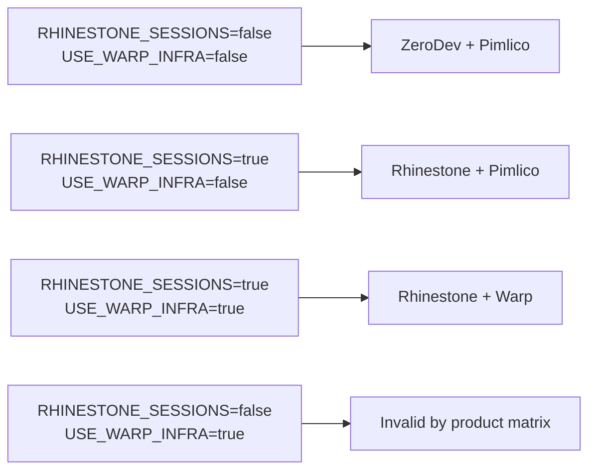

# FET-2953 Branch Verification

Date: 2026-03-04  
Branch: `feat/FET-2953-rhinestone-implementation`  
Goal: Verify local branch covers the full Rhinestone Sessions + Warp/Pimlico integration scope (FET-2953 and sub-issues FET-2954..FET-2967).

## Scope Checked

- Manager smart-account/session architecture
- Feature flags and infra resolution
- Transaction-manager signer, transport, and machine routing
- Warp actor test + key manager smart-account tests
- Typecheck for manager and transaction-manager

## High-Level Result

- **Overall status: Mostly complete and testable**
- Core architecture for:
  - ZeroDev + Pimlico fallback
  - Rhinestone + Pimlico
  - Rhinestone + Warp
  is present and validated with targeted tests/typechecks.
- No blocking compile issues remain after fixing one missing test import.

## Visual Overview (Mermaid)

### A) Feature Flag Decision Path



### B) Transaction Routing in `transaction.machine`



### C) Valid/Invalid Matrix



## Verification Matrix (Requested Behaviors)

### 1) `RHINESTONE_SESSIONS` and `USE_WARP_INFRA` flags

Status: ✅

Evidence:

- [feature-flags.ts](/Users/coderoasters/Coderoasters/apps-monorepo/apps/manager/src/utils/feature-flags.ts)
  - `RHINESTONE_SESSIONS`
  - `USE_WARP_INFRA`
  - `getSessionProvider()`
  - `getTransactionInfra()`
  - `resolveInfrastructure()`
- [feature-flags.test.ts](/Users/coderoasters/Coderoasters/apps-monorepo/apps/manager/src/utils/feature-flags.test.ts)
  - tests for provider/infra resolution and precedence

### 2) Session provider switching (ZeroDev vs Rhinestone)

Status: ✅

Evidence:

- [smart-account.machine.ts](/Users/coderoasters/Coderoasters/apps-monorepo/apps/manager/src/lib/smart-account/smart-account.machine.ts)
  - provider set from flags during `WALLET_CONNECTED`
  - session flows (`checkExistingSession`, `createSession`, `restoreSession`)
- [initialize-account.actor.ts](/Users/coderoasters/Coderoasters/apps-monorepo/apps/manager/src/lib/smart-account/actors/initialize-account.actor.ts)
  - routes external wallets by provider (`rhinestone`/`zerodev`)
  - para-embedded uses Pimlico path
- [session.actors.ts](/Users/coderoasters/Coderoasters/apps-monorepo/apps/manager/src/lib/smart-account/actors/session.actors.ts)
  - provider-specific create/restore + validation

### 3) Warp infrastructure support

Status: ✅

Evidence:

- [warp-transport.actor.ts](/Users/coderoasters/Coderoasters/apps-monorepo/packages/transaction-manager/src/actors/warp-transport.actor.ts)
- [transaction.machine.ts](/Users/coderoasters/Coderoasters/apps-monorepo/packages/transaction-manager/src/machines/transaction.machine.ts)
  - for `rhinestone` signer, routes by `options.infrastructure ?? signer.config.defaultInfra ?? 'pimlico'`
  - `warp` -> `submitWarpTransaction`
  - else -> `submitRhinestoneTransaction`
- [warp-transport.actor.test.ts](/Users/coderoasters/Coderoasters/apps-monorepo/packages/transaction-manager/src/actors/warp-transport.actor.test.ts)
  - **passed (9/9)**

### 4) Rhinestone session signer support (Pimlico path + session fields)

Status: ✅

Evidence:

- [rhinestone-transport.actor.ts](/Users/coderoasters/Coderoasters/apps-monorepo/packages/transaction-manager/src/actors/rhinestone-transport.actor.ts)
  - session signer pass-through:
    - uses `config.isSessionClient`
    - uses `config.sessionConfig.signers`
- [signer.types.ts](/Users/coderoasters/Coderoasters/apps-monorepo/packages/transaction-manager/src/types/signer.types.ts)
  - `RhinestoneSigner.config` has:
    - `isSessionClient`
    - `sessionPrivateKey`
    - `sessionConfig`
    - `defaultInfra`
  - `TransactionInfra` type
  - `isSessionSigner()`

### 5) SmartAccountContext/machine integration

Status: ✅

Evidence:

- [SmartAccountContext.tsx](/Users/coderoasters/Coderoasters/apps-monorepo/apps/manager/src/lib/smart-account/SmartAccountContext.tsx)
  - machine-backed state (`useActor` + selectors)
  - machine-native session actions (`promptSession`, `enableSession`, `dismissSession`)
- [RootProviders.tsx](/Users/coderoasters/Coderoasters/apps-monorepo/apps/manager/src/lib/RootProviders.tsx)
  - session modal rendered from context machine state
- `SmartSessionProvider` removed

### 6) Fallback behavior preservation

Status: ✅ (with note)

Evidence:

- Para embedded wallet path still exists in initializer/context/machine.
- ZeroDev path remains default fallback when flag disabled.
- EOA transport path still present in transaction machine.

Note:

- Matrix row `RHINESTONE_SESSIONS=false + USE_WARP_INFRA=true` is not rejected via explicit global guard in feature flags.
- Runtime routing still avoids invalid execution because `warp` decision is only used for `rhinestone` signer path in transaction machine.

## Test/Typecheck Commands Executed

Passed:

1. `pnpm --filter manager exec vitest run src/utils/feature-flags.test.ts src/lib/smart-account/actors/session.actors.test.ts src/lib/smart-account/sessions/rhinestone-session.test.ts src/lib/smart-account/sessions/session-storage.test.ts src/lib/smart-account/SmartAccountContext.test.tsx`
2. `pnpm --filter @ens-apps/transaction-manager typecheck`
3. `pnpm --filter @ens-apps/transaction-manager exec vitest run src/actors/warp-transport.actor.test.ts`
4. `pnpm typecheck:manager`

Observed non-blocking noise during tests:

- External network resolution warnings (`api.web3modal.org`) from environment side effects, but tests still passed.

## Fix Applied During Verification

One compile issue found and fixed:

- [session.actors.test.ts](/Users/coderoasters/Coderoasters/apps-monorepo/apps/manager/src/lib/smart-account/actors/session.actors.test.ts)
  - Added missing `KernelValidator` type import.

## Sub-Issue Coverage Summary

- FET-2954 ✅ (`@rhinestone/sdk` at `1.2.14` in manager + transaction-manager)
- FET-2955 ✅ (flags + tests)
- FET-2956 ✅ (dual session types)
- FET-2957 ✅ (ZeroDev pure session helpers)
- FET-2958 ✅ (Rhinestone pure session helpers)
- FET-2959 ✅ (account init actors)
- FET-2960 ✅ (session actors)
- FET-2961 ✅ (smart account machine)
- FET-2962 ✅ (context simplified around machine)
- FET-2963 ✅ (signer types updated + exported)
- FET-2964 ✅ (rhinestone transport supports session signer config)
- FET-2965 ✅ (warp transport actor + tests)
- FET-2966 ✅ (transaction machine infra routing)
- FET-2967 ⚠️ Partial from this branch verification
  - Integration/cleanup has substantial coverage via targeted tests and typechecks
  - No dedicated full end-to-end matrix test suite observed in this pass

## Runtime Happy Path (Rhinestone + Warp, external wallet)

Step-by-step trace of what happens when the feature flags are enabled and an external wallet connects:

1. **Wallet connects** — `SmartAccountContext` effect detects an external wallet and dispatches `WALLET_CONNECTED` to the XState machine. The machine reads feature flags and sets `provider: 'rhinestone'`, `infrastructure: 'warp'`.

2. **Account initialization** (`initializing` state) — `initializeAccountActor` routes to `initializeRhinestoneAccount()`, which creates a `RhinestoneAccount` via the Rhinestone SDK with Pimlico bundler. Returns `{ client: RhinestoneAccount, address, config }`.

3. **Session check** (`checkingSession` state) — `checkExistingSessionActor` looks up localStorage for a valid session matching the owner address and `'rhinestone'` provider. Para-embedded wallets skip sessions entirely (guard: `isParaEmbedded`).

4. **Session prompt/create** (`promptingSession` / `creatingSession` states) — If no session found, the user is prompted. On `ENABLE_SESSION`, `createSessionActor` calls `createRhinestoneSession()` which generates a session private key via `generatePrivateKey()`, stores serializable metadata in localStorage, and returns `{ session, sessionPrivateKey }`.

5. **Session restore** (`restoringSession` state) — If a valid session exists, `restoreSessionActor` calls `restoreRhinestoneSession()` which validates expiry and returns the stored `sessionPrivateKey`.

6. **Signer construction** (`ready` state) — `SmartAccountContext.useMemo` builds a `RhinestoneSigner` with:
   - `account`: the `RhinestoneAccount` from step 2
   - `config.isSessionClient`: true when a session exists
   - `config.sessionConfig.signers`: `{ type: 'experimental_session', session: { owners: { type: 'ecdsa', accounts: [sessionKeyAccount] }, chain } }`
   - `config.defaultInfra`: `'warp'`

7. **Transaction submission** — The transaction machine sees `signer.type === 'rhinestone'` and resolves infrastructure via `options.infrastructure ?? signer.config.defaultInfra ?? 'pimlico'`. With `defaultInfra: 'warp'`, it routes to `submitWarpTransaction`.

8. **Warp transport** — `submitWarpTransaction` calls `account.sendTransaction({ chain, calls, sponsored: true, signers })` then `account.waitForExecution(transaction)` and returns `receipt.fill.hash` as the on-chain transaction hash.

### SDK API Verification (against `@rhinestone/sdk` v1.2.14)

| API call | SDK type | Our usage | Status |
|----------|----------|-----------|--------|
| `sendTransaction({ chain, calls, sponsored, signers })` | `BaseTransaction` | Both transport actors | Correct |
| `waitForExecution(result)` returns `{ fill: { hash } }` | `TransactionStatus` | Both transport actors access `receipt.fill.hash` | Correct |
| `signers: { type: 'experimental_session', session }` | `SessionSignerSet` | Built in `SmartAccountContext` | Correct |
| `session: { owners: { type: 'ecdsa', accounts }, chain }` | `Session` | Built in `SmartAccountContext` | Correct |

### Known gap: on-chain session enablement

The Rhinestone SDK docs require two steps to activate sessions on-chain that are **not yet implemented**:

1. **`experimental_sessions: { enabled: true }`** in `createAccount()` — installs the session validator module on the smart account. Currently missing in `rhinestone.ts:84-89`.

2. **`experimental_enableSession()`** — an on-chain transaction that registers a specific session. Currently `createRhinestoneSession()` only generates a key pair locally but does not call the on-chain enablement flow (`experimental_getSessionDetails` / `experimental_signEnableSession` / `experimental_enableSession`).

**Impact**: Non-session transactions through Rhinestone + Warp/Pimlico work. Session-signed transactions will fail on-chain until the enablement steps are added. This is expected to be addressed in a follow-up ticket.

### Required environment variables

```
VITE_RHINESTONE_API_KEY=<rhinestone-api-key>
VITE_PIMLICO_API_KEY=<pimlico-api-key>
VITE_FF_RHINESTONE_SESSIONS=true
VITE_FF_USE_WARP_INFRA=true
```

## Additional Note

The reference path `docs/RHINESTONE_SESSIONS_PLAN.md` was not found in this branch.
Closest related doc found: `apps/manager/RHINESTONE_TEAM_SUMMARY.md`.
